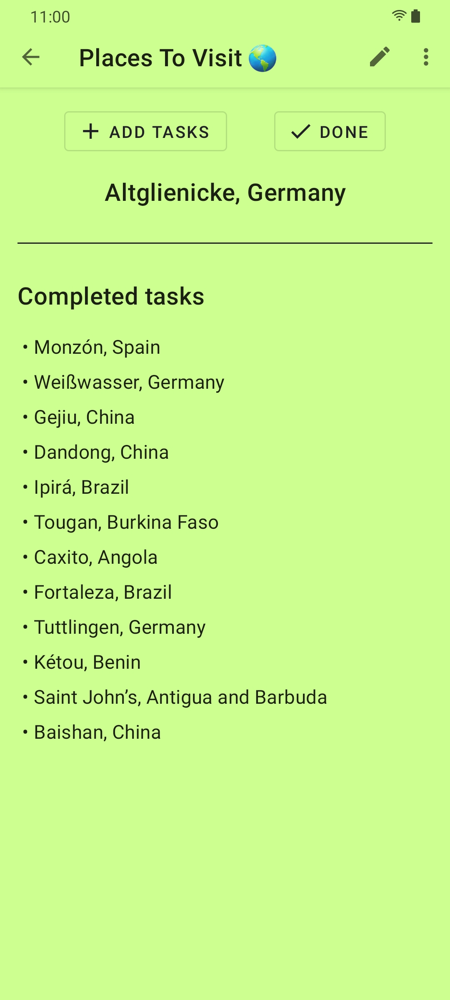
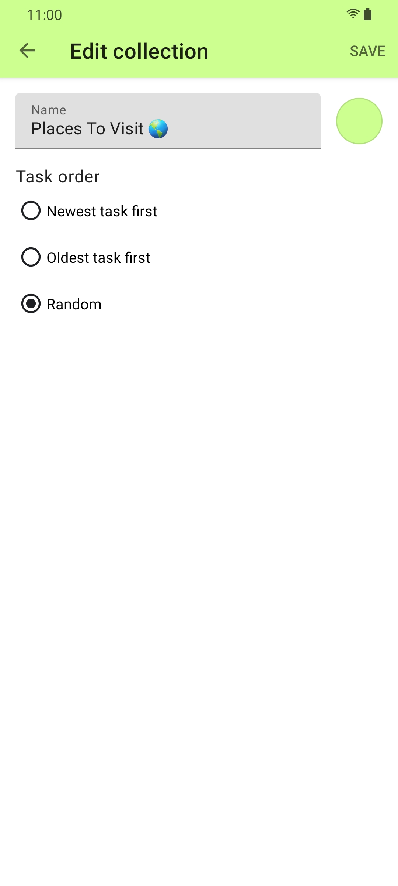

 
<h2 align="center"><b>Delist</b></h2>
<h4 align="center">Focus on the task at hand</h4>

 

<a href="https://github.com/ramzan/delist/releases/" alt="GitHub release">Get the APK</a>

 

## Screenshots

### Features

<b>Collect</b>: Create collections to gather all your tasks and ideas.

<b>Organize</b>: Choose the order in which you wish to complete your tasks: newest first, oldest first, or random.

<b>Focus</b>: Delist helps you focus by showing only one task at a time.

## License
  

Delist - Copyright (C) 2021  Ramzan Sheikh

This program is Free Software: You can use, study share and improve it at your
will. Specifically you can redistribute and/or modify it under the terms of the
[GNU General Public License](https://www.gnu.org/licenses/gpl.html) as
published by the Free Software Foundation, either version 3 of the License, or
(at your option) any later version.  
